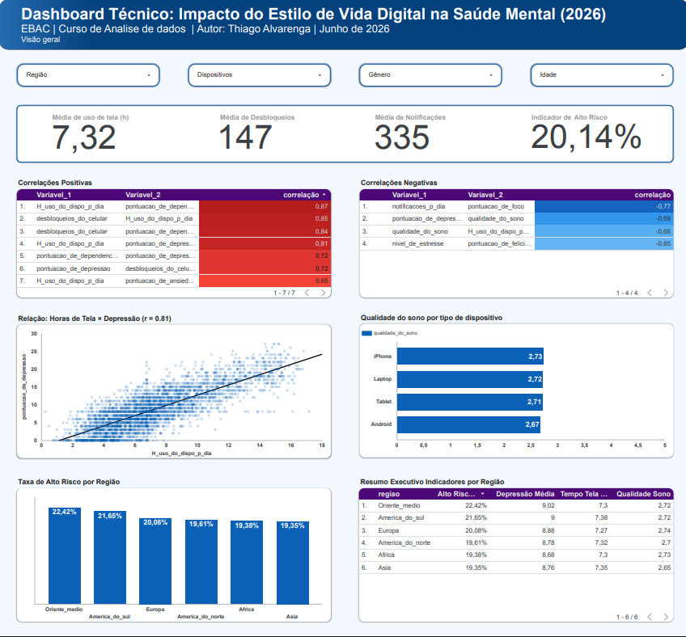

# Projeto: Impacto do Estilo de Vida Digital na Saúde Mental

## 📌 Visão Geral do Projeto

- **Problema abordado**: O uso excessivo de dispositivos digitais (tempo de tela, notificações, desbloqueios) está diretamente correlacionado ao aumento de sintomas de ansiedade, depressão e à degradação da qualidade do sono. Este projeto analisa dados para mensurar esse impacto e propor intervenções baseadas em evidências.

- **Objetivo**: Identificar, quantificar e modelar as relações entre hábitos digitais e indicadores de saúde mental (depressão, estresse, foco, qualidade do sono), utilizando técnicas estatísticas e de machine learning.

- **Metodologia**: Estruturação de pipeline de dados com Python (Pandas, NumPy), análise exploratória (correlações de Pearson e Spearman), modelos de regressão linear múltipla e visualização interativa no Looker Studio.

## 🎯 Etapas do Projeto

### 1. Dissertação sobre o Problema
- [📄 Relatório Técnico Completo](doc_relatorio/Relatório_Técnico_Impacto_do_Estilo_de_Vida_Digital_na_Saúde.pdf)
- **Resumo**: A hiperconectividade contemporânea impacta diretamente a saúde mental. O estudo revelou que cada hora adicional de tela eleva a pontuação de depressão em 1.22 pontos (p<0.001).

### 2. Fontes de Dados
| Fonte | Tipo | Método de Coleta | Link |
|-------|------|------------------|------|
| Digital Health and Mental Wellness Benchmark | Estruturado (CSV) | Download direto do Kaggle | [Kaggle Dataset](https://www.kaggle.com/datasets/tarekmasryo/digital-health-and-mental-wellness?resource=download) |

- **Registros**: 3.500 participantes sintéticos
- **Variáveis**: 24 (demográficas, comportamentais e de saúde mental)
- **Licença**: CC BY 4.0

### 3. Análise Exploratória (EDA)
- **Scripts Python**:
  - [01_limpeza_dados.py](scripts/01_limpeza_dados.py) - Limpeza, tradução e otimização de memória (redução de 64%)
  - [02_analise_exploratoria.py](scripts/02_analise_exploratoria.py) - Correlações (Pearson e Spearman) e estatísticas descritivas
  - [03_modelagem_regressao.py](scripts/03_modelagem_regressao.py) - Modelos preditivos de regressão linear
      * *Gerenciamento de Métricas:* Este script /03_modelagem... conta com uma rotina automatizada de logging. A cada execução, os resultados de performance ($R^2$, RMSE e MAE) de ambos os modelos são calculados e empilhados no arquivo `regression_models_history.json`, permitindo o rastreamento histórico de evolução dos experimentos através de tags de status personalizadas.

**Bibliotecas utilizadas**:
- Pandas, NumPy (ETL e manipulação)
- Seaborn, Matplotlib (visualizações)
- Scikit-learn (modelos de regressão, métricas R² e RMSE)
- Joblib (persistência dos modelos)

- **Principais descobertas**:
 - 📈 Correlação positiva forte entre tempo de tela e depressão (r=0.81)
- 📉 Correlação negativa forte entre notificações e foco (r=-0.77)
- 🔄 Ciclo vicioso: Tela → Sono ruim → Depressão → Mais tela
- 🏛️ Renda não é fator protetivo: risco é homogêneo entre classes sociais
- 🎓 Paradoxo educacional: Doutores têm menor risco, mas maior depressão absoluta
- 😊 Gênero masculino tem mais felicidade (6,47) e mais foco (42,08) do que o feminino (6,37 e 41,16)
- 😰 Desempregados são a classe com maior estresse (5,25) e maior tempo de tela (7,79h)
- 🧠 Doutores lideram a média de depressão (9,2 pontos), mesmo tendo o menor risco técnico (18,02%)
- 👩 Mulheres são mais afetadas emocionalmente: mais estresse (5,13 vs 5,02) e menos felicidade que homens
- ⚖️ Homens têm vantagem sutil em foco e produtividade, mas a entrega funcional é quase idêntica entre gêneros

### 4. Relatório de Insights
- [📄 Relatório de Insights](doc_relatorio/Relatório_Técnico_Impacto_do_Estilo_de_Vida_Digital_na_Saúde.pdf)
- **Modelos de Regressão**:
  - **Modelo A (Depressão)**: R²=0.64, RMSE=3.43
  - **Modelo B (Sono)**: R²=0.50, RMSE=0.79

### 5. Dashboard no Looker Studio
- **Link Interativo**: [Dashboard Completo](https://datastudio.google.com/reporting/4f7bf1e3-ae2f-4df8-8a49-95b6ab9ea15f)

#### 📱 Página 1 - Hábitos Digitais & Indicadores de Saúde Mental
- **Link Direto**: [Acessar Página 1](https://datastudio.google.com/reporting/4f7bf1e3-ae2f-4df8-8a49-95b6ab9ea15f/page/l561F)
- **Conteúdo**: KPIs de Tempo de Tela, Desbloqueios e Notificações, matrizes de correlação, modelo de regressão (Tela × Depressão), taxa de alto risco por região e métricas executivas.

<div align="center">
  
</div>

<br>

#### 📊 Página 2 - Análise Socioeconômica & Demográfica
- **Link Direto**: [Acessar Página 2](https://datastudio.google.com/reporting/4f7bf1e3-ae2f-4df8-8a49-95b6ab9ea15f/page/p_gavhuyg04d)
- **Conteúdo**: Análise de risco por nível de renda e escolaridade, dispersão de depressão por perfil socioeconômico, impacto ocupacional em tela/estresse e comparações de gênero em foco e felicidade.

<div align="center">
  
</div>

## 🛠️ Tecnologias Utilizadas

| Ferramenta | Finalidade |
|------------|------------|
| Python (Pandas, NumPy) | ETL, limpeza e transformação |
| Python (Matplotlib, Seaborn) | Visualizações estáticas |
| Python (Scikit-learn) | Modelos de regressão linear |
| Google Looker Studio | Dashboard interativo |
| PyCharm | Desenvolvimento dos scripts |

## 📂 Estrutura do Repositório

```text
analise_dados_problema_real/
│
├── dados/                              # Datasets brutos e processados do projeto
├── doc_relatorio/                      # Relatório técnico e documentação em PDF
├── imagens/                            # Screenshots e previews dos Dashboards
│   ├── 01_imagem_dash.png              # Print da Página 1 do Looker Studio
│   └── 02_imagem_dash .png             # Print da Página 2 do Looker Studio
├── resultados_graficos/                # Exportações das visualizações geradas pelos scripts
├── scripts/                            # Pipeline de códigos Python (ETL, EDA e Regressão)
├── regression_models_history.json      # Histórico automatizado de performance dos modelos
└── README.md                           # Documentação completa do repositório

